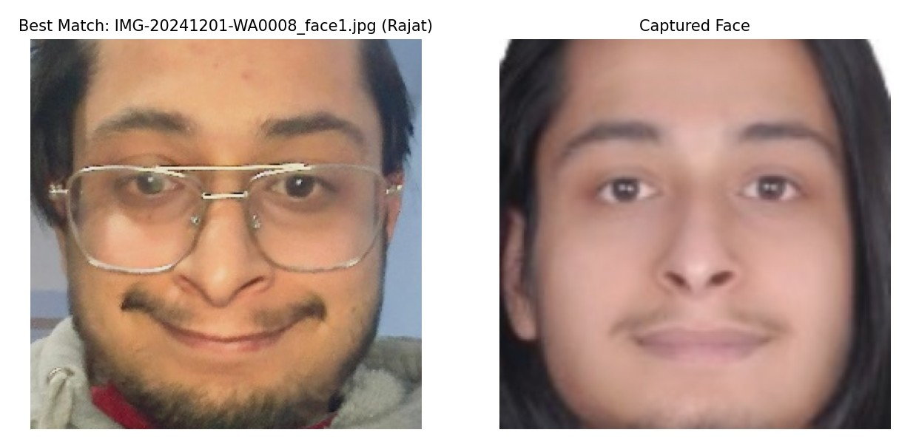

# Face Recognition System Using Siamese Network (FaceNet Architecture)

## Model Training Parameters
- **Hardware**: NVIDIA GeForce RTX 2060
- **Batch Size**: 16
- **Learning Rates**: 0.001 and 0.0001
- **Epochs**: 20 (with early stopping)
- **Contrastive Loss Margin**: 1.0
- **Threshold**: 0.5
- **Optimizer**: RMSprop

## Setup and Installation

### Step 1: Download Dataset
Download the face dataset from Kaggle and extract it:
- Dataset Link: [Face Dataset](https://www.kaggle.com/datasets/rajatdulal/face-dataset)
- Extract the dataset as `Face_Dataset`

### Step 2: Install Requirements
Install the necessary Python packages:
```bash
pip install -r requirements.txt
```

### Step 3: Prepare Image Pairs
Generate a CSV file for sending image pairs to the Siamese model:
```bash
python prepare_imagepair_csv.py --path Face_Dataset
```

### Step 4: Train the Model
Open the `train.ipynb` notebook to train or fine-tune the model:
- The trained model will be saved as `model_weights.pth`

### Step 5: Prepare Identity Images
Place images of identities you want to recognize:
- Create images for each identity in the `Owner_identification/Identity1`, `Owner_identification/Identity2`, etc. folders
- These images will serve as base images for comparison

#### Optional Step 5.5: Face Extraction
Run the face extraction script for better results:
```bash
python prepare_inference_dataset.py Owner_identification Owner_identification
```
> **Note**: Verify extracted faces and remove any incorrect images

### Step 6: Capture Input Image
Capture a live image or place an image in the `Input_images` folder:
```bash
python capture_input_image.py
```
> **Ensure the image is named `captured.jpg`**

### Step 7: Configure Gmail App Password
1. Go to [Google Account Security](https://myaccount.google.com/security)
2. Search for "App password"
3. Generate and copy your app password
4. Update the environment file (.env) with your Gmail and app password

### Step 8: Run Inference
```bash
python inference.py
```
## Output



## Troubleshooting
- Ensure all dependencies are correctly installed
- Check that image paths are correct
- Verify the format of your input images

<!-- ## License
[Add your license information here]

## Contributing
[Add contribution guidelines if applicable] -->

## Contact
[rjtdulal@gmail.com]
